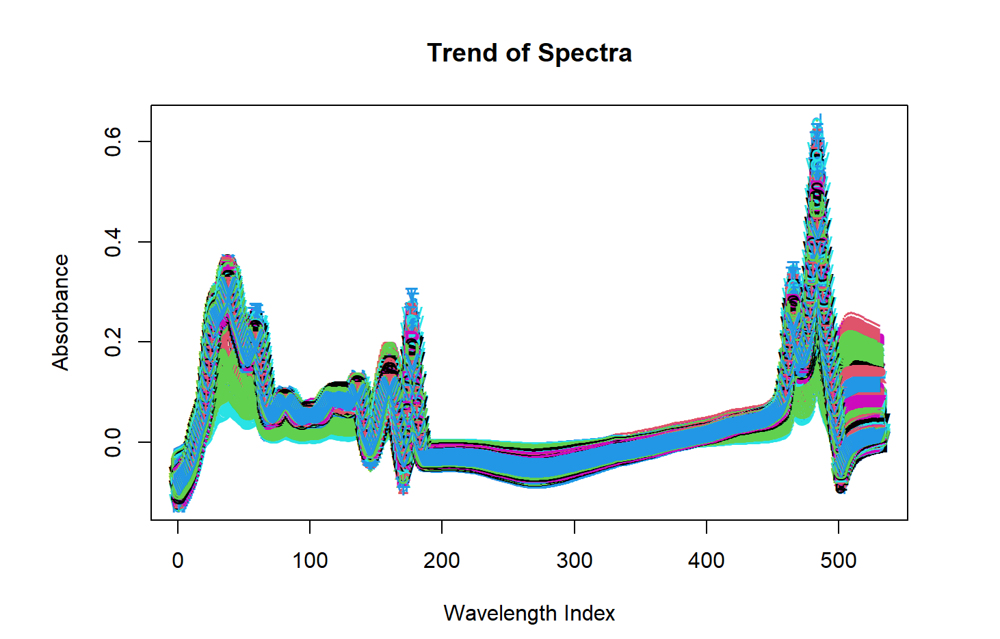
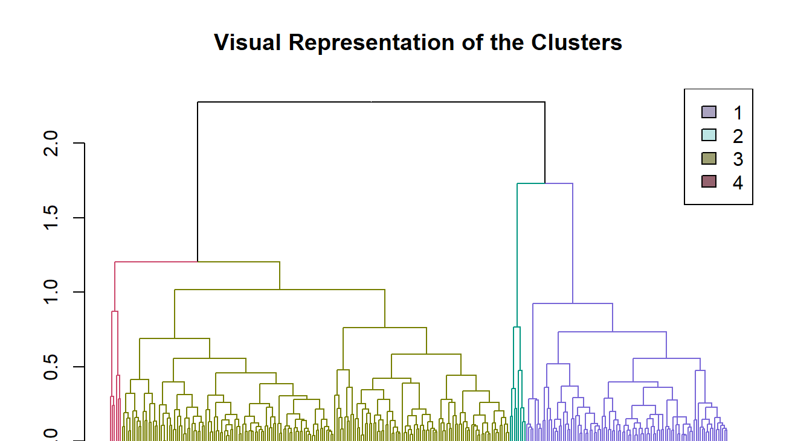
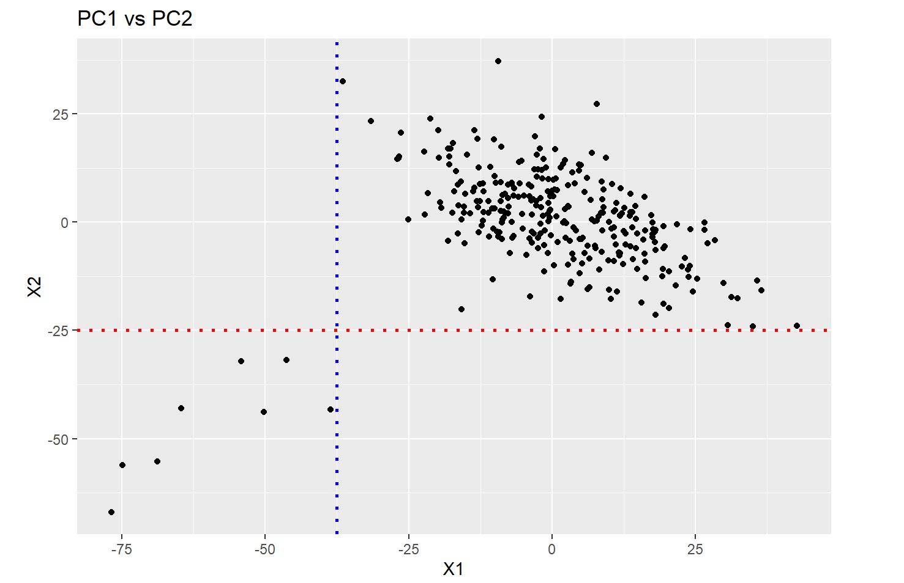

# Analysis of Spectral Data of Irish Milk

### Software 
R 

[Dataset](https://github.com/Gautua/Spectral-Analysis/blob/main/Milk_MIR_Traits_data.csv) - Milk MIR Traits Data 

#### Description:

This project aimed to establish if the spectral analysis is a viable alternative to the gold standard tests currently employed in the industry for the quality of milk. 
 
* Exploratory data analysis was conducted on the data to visualize the spectra of the observed samples, focusing on traits corresponding to fats and proteins such as alpha casein.

* A rudimentary hierarchical clustering, the K-means algorithm was used to cluster the observations to establish possible structures in the milk samples based on the data from the spectral analysis of the data.

* Observed different groups of sampling with distinct dominating traits such as lactose, casein, and protein contents. 

* Principal Component Analysis was used to reduce the dimensions, the choice of the number of principal components to be included in the analysis was made based on scree plots and the proportion of variances explained by respective principal components.

Using the reduced dimensions allows the visualization of the data to obtain further perspective on the clusters available in the data.

* Using the principal components, employed PLSR (Regression Model) to predict the traits of the milk samples based solely on the spectral analysis data, resulting in a sufficient level of correspondence between our predicted values and those obtained through the golden standard tests for the respective traits.

#### Screenshots

  
&nbsp; &nbsp; &nbsp; &nbsp;
  

&nbsp; &nbsp; &nbsp; &nbsp;
  
 &nbsp; &nbsp; &nbsp; &nbsp;
  
 

